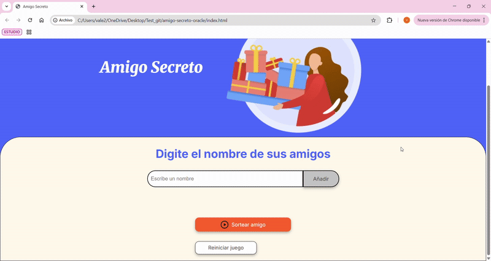

<h1 align="center"> CHALLENGE #1 ONE </h1>

<p align="center">
  
</p>

## Índice

- [Descripción del proyecto](#descripción-del-proyecto)
- [Estado del proyecto](#estado-del-proyecto)
- [Características de la aplicación y demostración](#características-de-la-aplicación-y-demostración)
- [Acceso al proyecto](#acceso-proyecto)
- [Tecnologías utilizadas](#tecnologías-utilizadas)
- [Conclusión](#conclusión)


## Descripción del proyecto
Este proyecto es parte del Challenge #1 del programa ONE (Oracle Next Education) de la mano con Alura LATAM. Consiste en una plagina mediante la cual el usuario podra ingresar una lista ilimitada de amigos, con el fin de escoger uno aleatoriamente como "amigo secreto". Fue preconstruida con HTML y CSS y posteriormente ajustada mediante JavaScript.

## Estado del proyecto
✅ Proyecto terminado y funcional.  
🛠 Se podrían hacer mejoras en diseño responsive y validaciones extra.

## Características de la aplicación y demostración
- Añadir nombres de amigos, sin repetir, borrando el espacio cada vez que se agregan, mediante el uso de boton.
- Mostrar en pantalla la lista de los nombres añadidos.
- Sortear aleatoriamente un nombre mediante el uso de boton.
- inicio de nuevo juego con boton
- Interfaz sencilla y clara.

## 🎬 Demostración


## Acceso proyecto
📁 Clona este repositorio:

```bash
git clone https://github.com/ValentinaQuinteroC/amigo-secreto-oracle.git

```

## Tecnologías utilizadas
✅HTML
✅JavaScript
✅CSS
✅Visual Studio Code


## Conclusión
Con este reto, el usuario puede ingresar una lista de nombres sin repeticiones, verlos en pantalla y sortear de forma aleatoria un "amigo secreto", todo con una interfaz sencilla e intuitiva. También se incorporó un botón para reiniciar el juego, permitiendo volver a empezar sin recargar la página.

Más allá del resultado funcional, este reto me permitió fortalecer mi lógica de programación, enfrentarme a errores reales y buscar soluciones por mi cuenta, lo cual ha sido esencial en mi proceso de aprendizaje como desarrolladora
